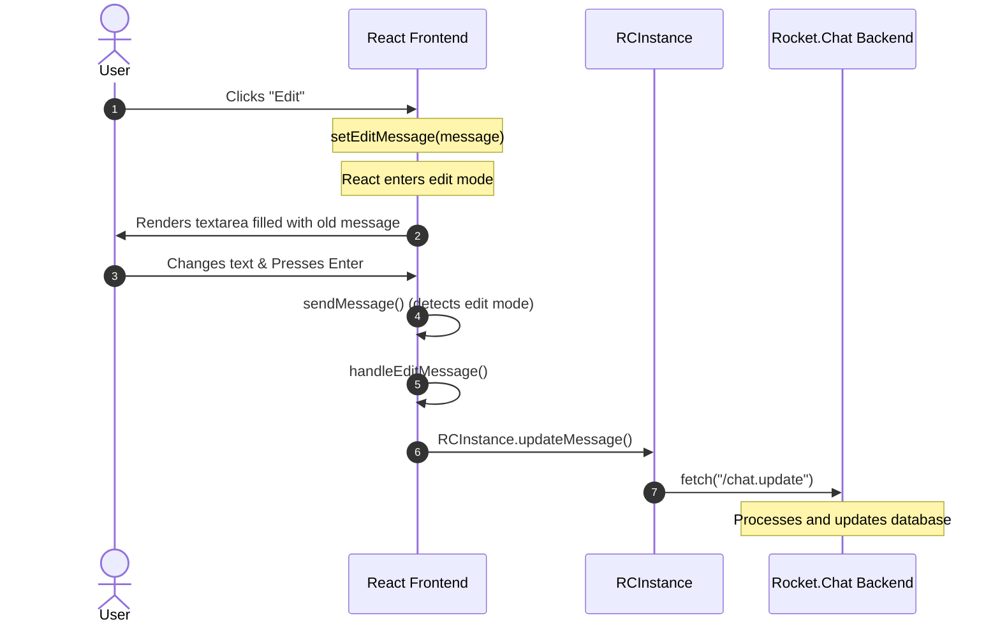
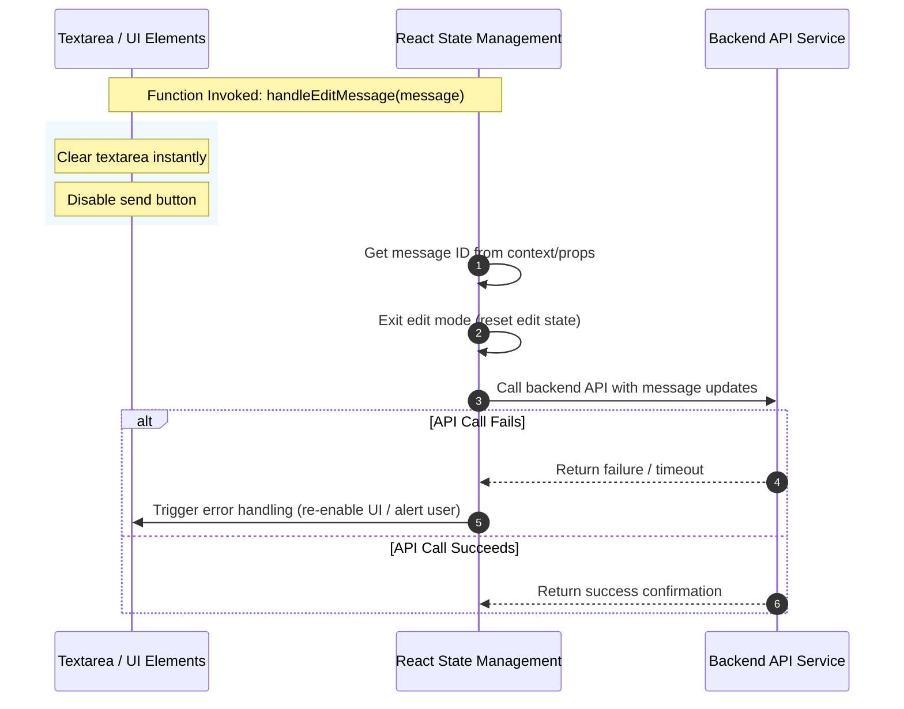

# Flow of sendMessage() function:
### Message Edit Flow Diagram

```mermaid
sequenceDiagram
    autonumber
    actor User
    participant Frontend as React Frontend
    participant Instance as RCInstance
    participant Backend as Rocket.Chat Backend

    User->>Frontend: Clicks "Edit"
    Note over Frontend: setEditMessage(message)
    Note over Frontend: React enters edit mode
    Frontend->>User: Renders textarea filled with old message
    
    User->>Frontend: Changes text & Presses Enter
    Frontend->>Frontend: sendMessage() (detects edit mode)
    Frontend->>Frontend: handleEditMessage()
    
    Frontend->>Instance: RCInstance.updateMessage()
    Instance->>Backend: fetch("/chat.update")
    Note over Backend: Processes and updates database
```

## handleEditMessage() function:
### Detailed `handleEditMessage` Execution Flow

```mermaid
sequenceDiagram
    autonumber
    participant UI as Textarea / UI Elements
    participant State as React State Management
    participant API as Backend API Service

    Note over UI, State: Function Invoked: handleEditMessage(message)
    
    %% Immediate UI Actions
    rect rgb(240, 248, 255)
        Note over UI: Clear textarea instantly
        Note over UI: Disable send button
    end

    %% State & Data Preparation
    State->>State: Get message ID from context/props
    State->>State: Exit edit mode (reset edit state)
    
    %% Network Call
    State->>API: Call backend API with message updates
    
    %% Error Handling Branch
    alt API Call Fails
        API-->>State: Return failure / timeout
        State->>UI: Trigger error handling (re-enable UI / alert user)
    else API Call Succeeds
        API-->>State: Return success confirmation
    end
```
