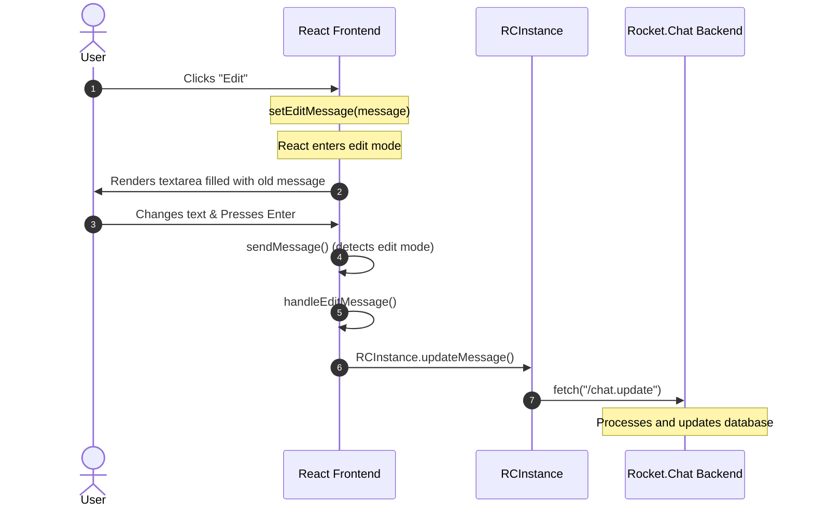

# Flow of sendMessage() function:
### Message Edit Flow Diagram

```mermaid
sequenceDiagram
    autonumber
    actor User
    participant Frontend as React Frontend
    participant Instance as RCInstance
    participant Backend as Rocket.Chat Backend

    User->>Frontend: Clicks "Edit"
    Note over Frontend: setEditMessage(message)
    Note over Frontend: React enters edit mode
    Frontend->>User: Renders textarea filled with old message
    
    User->>Frontend: Changes text & Presses Enter
    Frontend->>Frontend: sendMessage() (detects edit mode)
    Frontend->>Frontend: handleEditMessage()
    
    Frontend->>Instance: RCInstance.updateMessage()
    Instance->>Backend: fetch("/chat.update")
    Note over Backend: Processes and updates database
```
